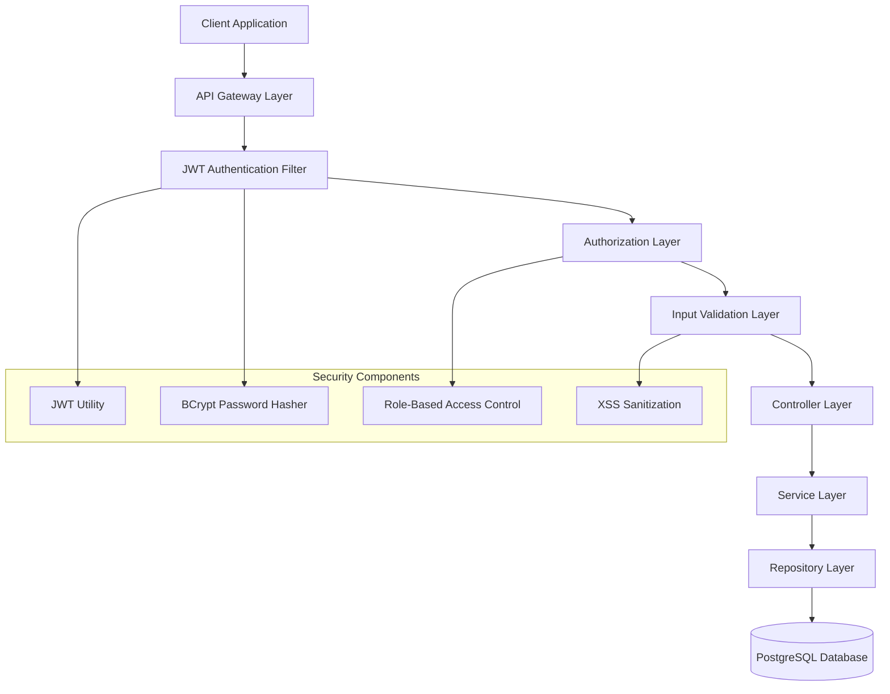
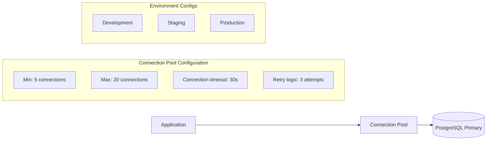
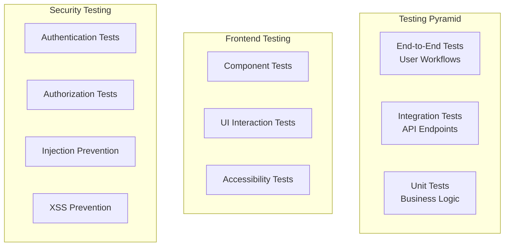
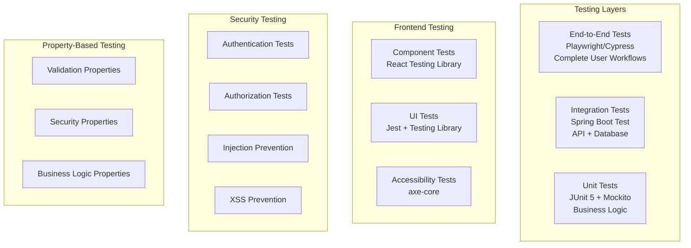

# Design Document: Core Stability Phase 1

## Overview

This design document outlines the technical approach for transforming SportSync from a development prototype into a production-ready system. The current application uses permissive security configurations, an in-memory H2 database, minimal input validation, and lacks comprehensive testing. This phase focuses on implementing robust security, persistent data storage, comprehensive validation, and thorough testing infrastructure.

The design addresses 12 core requirements spanning security architecture, validation frameworks, database migration, and testing infrastructure. The implementation will maintain backward compatibility while significantly enhancing system reliability, security, and maintainability.

### Key Objectives

- **Security Hardening**: Implement JWT-based authentication, BCrypt password hashing, and role-based access control
- **Data Persistence**: Migrate from H2 in-memory to PostgreSQL with proper connection pooling
- **Input Validation**: Establish comprehensive validation at both frontend and backend layers
- **Testing Infrastructure**: Create unit, integration, and end-to-end testing frameworks
- **Production Readiness**: Implement proper error handling, logging, and configuration management

## Architecture

### Security Architecture

The security architecture implements a layered approach with authentication, authorization, and input validation as core components:



### Database Architecture

The database architecture transitions from in-memory H2 to persistent PostgreSQL with proper connection management:



### Testing Architecture

The testing architecture provides comprehensive coverage across multiple layers:



## Components and Interfaces

### Authentication Component

**Purpose**: Manages user authentication using JWT tokens and BCrypt password hashing.

**Key Classes**:
- `JwtUtil`: Token generation, validation, and extraction
- `JwtAuthenticationFilter`: Request interception and token validation
- `PasswordEncoder`: BCrypt-based password hashing with 12+ rounds
- `AuthController`: Authentication endpoints (login, register)

**Interfaces**:
```java
public interface AuthenticationService {
    AuthResponseDTO authenticate(AuthRequestDTO request);
    AuthResponseDTO register(RegisterRequestDTO request);
    boolean validateToken(String token);
    void logout(String token);
}

public interface PasswordService {
    String hashPassword(String plainPassword);
    boolean verifyPassword(String plainPassword, String hashedPassword);
    boolean isPasswordStrong(String password);
}
```

### Authorization Component

**Purpose**: Implements role-based access control with method-level security.

**Key Classes**:
- `SecurityConfig`: Spring Security configuration with JWT integration
- `RoleBasedAccessControl`: Role validation and permission checking
- `MethodSecurityConfig`: Method-level security annotations

**Interfaces**:
```java
public interface AuthorizationService {
    boolean hasRole(String username, Role role);
    boolean canAccessResource(String username, String resourceId, Permission permission);
    Set<Permission> getUserPermissions(String username);
}

public enum Role {
    USER, ADMIN
}

public enum Permission {
    READ_EVENT, CREATE_EVENT, UPDATE_EVENT, DELETE_EVENT,
    READ_USER, UPDATE_USER, DELETE_USER,
    MANAGE_SYSTEM
}
```

### Validation Component

**Purpose**: Provides comprehensive input validation and sanitization.

**Key Classes**:
- `ValidationConfig`: Custom validation configuration
- `InputSanitizer`: XSS prevention and input cleaning
- `CustomValidators`: Business-specific validation rules

**Interfaces**:
```java
public interface ValidationService {
    ValidationResult validate(Object input);
    String sanitizeInput(String input);
    boolean isValidEmail(String email);
    boolean isValidCoordinate(double latitude, double longitude);
}

public class ValidationResult {
    private boolean valid;
    private Map<String, List<String>> fieldErrors;
    // getters, setters
}
```

### Database Migration Component

**Purpose**: Manages database schema evolution and environment-specific configurations.

**Key Classes**:
- `DatabaseConfig`: Environment-specific database configurations
- `ConnectionPoolConfig`: HikariCP connection pool setup
- `MigrationManager`: Schema migration management

**Configuration Properties**:
```yaml
# Development Environment
spring:
  datasource:
    url: jdbc:postgresql://localhost:5432/sportsync_dev
    username: ${DB_USERNAME:sportsync_dev}
    password: ${DB_PASSWORD:dev_password}
    hikari:
      minimum-idle: 5
      maximum-pool-size: 20
      connection-timeout: 30000
      idle-timeout: 600000
      max-lifetime: 1800000

# Production Environment  
spring:
  datasource:
    url: jdbc:postgresql://${DB_HOST}:${DB_PORT}/${DB_NAME}
    username: ${DB_USERNAME}
    password: ${DB_PASSWORD}
    hikari:
      minimum-idle: 10
      maximum-pool-size: 50
      connection-timeout: 20000
      idle-timeout: 300000
      max-lifetime: 1200000
```

## Data Models

### Enhanced User Entity

The User entity is enhanced with security and validation annotations:

```java
@Entity
@Table(name = "users")
public class User {
    @Id
    @GeneratedValue(strategy = GenerationType.IDENTITY)
    private Long id;

    @NotBlank(message = "Name is required")
    @Size(min = 2, max = 100, message = "Name must be between 2 and 100 characters")
    @Column(nullable = false, length = 100)
    private String name;

    @NotBlank(message = "Email is required")
    @Email(message = "Email must be valid")
    @Column(nullable = false, unique = true, length = 255)
    private String email;

    @NotBlank(message = "Password is required")
    @Size(min = 60, max = 60, message = "Password hash must be exactly 60 characters")
    @Column(nullable = false, length = 60)
    private String passwordHash;

    @Enumerated(EnumType.STRING)
    @Column(nullable = false)
    private Role role = Role.USER;

    @Valid
    @ElementCollection
    @CollectionTable(name = "user_preferred_sports")
    private List<@NotBlank String> preferredSports;

    @NotNull(message = "Skill level is required")
    @Enumerated(EnumType.STRING)
    private SkillLevel skillLevel;

    @DecimalMin(value = "-90.0", message = "Latitude must be between -90 and 90")
    @DecimalMax(value = "90.0", message = "Latitude must be between -90 and 90")
    @Column(nullable = false)
    private Double latitude;

    @DecimalMin(value = "-180.0", message = "Longitude must be between -180 and 180")
    @DecimalMax(value = "180.0", message = "Longitude must be between -180 and 180")
    @Column(nullable = false)
    private Double longitude;

    @DecimalMin(value = "0.0", message = "Reputation score cannot be negative")
    @DecimalMax(value = "5.0", message = "Reputation score cannot exceed 5.0")
    @Column(nullable = false)
    private Double reputationScore = 0.0;

    @CreationTimestamp
    @Column(nullable = false, updatable = false)
    private LocalDateTime createdAt;

    @UpdateTimestamp
    @Column(nullable = false)
    private LocalDateTime updatedAt;
}
```

### Enhanced Event Entity

```java
@Entity
@Table(name = "events")
public class Event {
    @Id
    @GeneratedValue(strategy = GenerationType.IDENTITY)
    private Long id;

    @NotBlank(message = "Title is required")
    @Size(min = 3, max = 200, message = "Title must be between 3 and 200 characters")
    @Column(nullable = false, length = 200)
    private String title;

    @Size(max = 1000, message = "Description cannot exceed 1000 characters")
    @Column(length = 1000)
    private String description;

    @NotBlank(message = "Sport is required")
    @Pattern(regexp = "^(BASKETBALL|SOCCER|TENNIS|VOLLEYBALL|BADMINTON)$", 
             message = "Sport must be one of: BASKETBALL, SOCCER, TENNIS, VOLLEYBALL, BADMINTON")
    @Column(nullable = false)
    private String sport;

    @Future(message = "Event date must be in the future")
    @NotNull(message = "Event date is required")
    @Column(nullable = false)
    private LocalDateTime eventDate;

    @DecimalMin(value = "-90.0")
    @DecimalMax(value = "90.0")
    @Column(nullable = false)
    private Double latitude;

    @DecimalMin(value = "-180.0")
    @DecimalMax(value = "180.0")
    @Column(nullable = false)
    private Double longitude;

    @Min(value = 2, message = "Maximum participants must be at least 2")
    @Max(value = 100, message = "Maximum participants cannot exceed 100")
    @Column(nullable = false)
    private Integer maxParticipants;

    @NotNull(message = "Skill level is required")
    @Enumerated(EnumType.STRING)
    private SkillLevel skillLevel;

    @NotNull(message = "Event status is required")
    @Enumerated(EnumType.STRING)
    private EventStatus status = EventStatus.OPEN;

    @ManyToOne(fetch = FetchType.LAZY)
    @JoinColumn(name = "creator_id", nullable = false)
    private User creator;

    @CreationTimestamp
    private LocalDateTime createdAt;

    @UpdateTimestamp
    private LocalDateTime updatedAt;
}
```

### Database Schema Migration

The migration from H2 to PostgreSQL requires careful schema translation:

```sql
-- Initial PostgreSQL Schema
CREATE TABLE users (
    id BIGSERIAL PRIMARY KEY,
    name VARCHAR(100) NOT NULL,
    email VARCHAR(255) NOT NULL UNIQUE,
    password_hash VARCHAR(60) NOT NULL,
    role VARCHAR(20) NOT NULL DEFAULT 'USER',
    skill_level VARCHAR(20) NOT NULL,
    latitude DECIMAL(10, 8) NOT NULL,
    longitude DECIMAL(11, 8) NOT NULL,
    reputation_score DECIMAL(3, 2) NOT NULL DEFAULT 0.0,
    created_at TIMESTAMP NOT NULL DEFAULT CURRENT_TIMESTAMP,
    updated_at TIMESTAMP NOT NULL DEFAULT CURRENT_TIMESTAMP
);

CREATE TABLE events (
    id BIGSERIAL PRIMARY KEY,
    title VARCHAR(200) NOT NULL,
    description TEXT,
    sport VARCHAR(50) NOT NULL,
    event_date TIMESTAMP NOT NULL,
    latitude DECIMAL(10, 8) NOT NULL,
    longitude DECIMAL(11, 8) NOT NULL,
    max_participants INTEGER NOT NULL,
    skill_level VARCHAR(20) NOT NULL,
    status VARCHAR(20) NOT NULL DEFAULT 'OPEN',
    creator_id BIGINT NOT NULL REFERENCES users(id),
    created_at TIMESTAMP NOT NULL DEFAULT CURRENT_TIMESTAMP,
    updated_at TIMESTAMP NOT NULL DEFAULT CURRENT_TIMESTAMP
);

-- Indexes for performance
CREATE INDEX idx_events_creator_id ON events(creator_id);
CREATE INDEX idx_events_event_date ON events(event_date);
CREATE INDEX idx_events_sport ON events(sport);
CREATE INDEX idx_events_location ON events(latitude, longitude);
CREATE INDEX idx_users_email ON users(email);
```

## Correctness Properties

*A property is a characteristic or behavior that should hold true across all valid executions of a system-essentially, a formal statement about what the system should do. Properties serve as the bridge between human-readable specifications and machine-verifiable correctness guarantees.*

Before defining the correctness properties, I need to analyze the acceptance criteria from the requirements document to determine which are testable as properties.


### Property 1: Password Security Round Trip

*For any* password input, hashing with BCrypt (minimum 12 rounds) and then verifying with the original password should return true, and the hash should use a unique salt.

**Validates: Requirements 1.2, 1.8**

### Property 2: JWT Token Lifecycle

*For any* valid user credentials, authentication should generate a JWT token with exactly 24-hour expiration that validates successfully until expiration.

**Validates: Requirements 1.3, 1.5**

### Property 3: Authentication Failure Response

*For any* invalid credentials or expired/invalid JWT tokens, the authentication system should return HTTP 401 with a generic error message.

**Validates: Requirements 1.4, 1.6, 4.4**

### Property 4: Password Strength Validation

*For any* password input, the system should enforce minimum 8 characters with mixed case, numbers, and special characters.

**Validates: Requirements 1.7**

### Property 5: Role-Based Access Control

*For any* user and protected endpoint combination, access should be granted only if the user has the required role permissions.

**Validates: Requirements 2.2, 2.3, 2.4, 2.5**

### Property 6: Authorization Failure Response

*For any* unauthorized access attempt, the system should return HTTP 403 with an access denied message.

**Validates: Requirements 2.6, 4.5**

### Property 7: Input Validation Coverage

*For any* API request, all parameters and body content should be validated according to defined rules.

**Validates: Requirements 3.1**

### Property 8: Validation Error Response

*For any* invalid input data, the system should return HTTP 400 with specific field error messages.

**Validates: Requirements 3.2, 4.3**

### Property 9: XSS Prevention

*For any* string input, the system should sanitize content to prevent XSS attacks while preserving legitimate content.

**Validates: Requirements 3.3**

### Property 10: Email Format Validation

*For any* email input, the system should validate format according to RFC 5322 standard.

**Validates: Requirements 3.4**

### Property 11: Geographic Coordinate Validation

*For any* coordinate input, latitude should be between -90 and 90, and longitude should be between -180 and 180.

**Validates: Requirements 3.5**

### Property 12: Future Date Validation

*For any* event date input, the system should ensure the date is in the future.

**Validates: Requirements 3.6**

### Property 13: String Length Constraints

*For any* string field input, the system should enforce database-defined length limits.

**Validates: Requirements 3.7**

### Property 14: Enum Validation

*For any* skill level or sport type input, the system should validate against predefined enum values.

**Validates: Requirements 3.8, 3.9**

### Property 15: Numeric Range Validation

*For any* numeric input, the system should validate ranges and prevent overflow conditions.

**Validates: Requirements 3.10**

### Property 16: Exception Handling Coverage

*For any* unhandled exception, the system should return appropriate HTTP status codes and log complete details.

**Validates: Requirements 4.1, 4.6, 4.7**

### Property 17: Resource Not Found Response

*For any* request for non-existent resources, the system should return HTTP 404 with resource identifier.

**Validates: Requirements 4.2**

### Property 18: Sensitive Information Protection

*For any* error response, the system should never expose sensitive information like passwords or internal system details.

**Validates: Requirements 4.8**

### Property 19: Frontend Real-Time Validation

*For any* user input in frontend forms, validation should occur in real-time with immediate feedback.

**Validates: Requirements 5.1, 5.2, 5.3, 5.4, 5.8**

### Property 20: Form Submission Prevention

*For any* form with validation errors, submission should be prevented until all errors are resolved.

**Validates: Requirements 5.5**

### Property 21: Frontend Date and Numeric Validation

*For any* date or numeric input in frontend forms, validation should enforce future dates and proper numeric ranges.

**Validates: Requirements 5.6, 5.7**

### Property 22: Data Migration Integrity

*For any* existing data, migration from H2 to PostgreSQL should preserve all data structure and relationships.

**Validates: Requirements 6.3**

### Property 23: Database Rollback Capability

*For any* schema migration, the system should provide rollback functionality to revert changes.

**Validates: Requirements 6.7**

### Property 24: Connection Management

*For any* database operation, the system should handle connection timeouts and implement retry logic.

**Validates: Requirements 6.8**

### Property 25: Environment Configuration Loading

*For any* environment variable dependency, the system should load configuration correctly or provide clear error messages when missing.

**Validates: Requirements 7.2, 7.5**

### Property 26: Database Connection Validation

*For any* application startup, the system should validate database connectivity and implement health checks.

**Validates: Requirements 7.6, 7.7**

## Error Handling

### Exception Hierarchy

The application implements a comprehensive exception handling strategy with custom exceptions and global error handling:

```java
// Base application exception
public abstract class SportSyncException extends RuntimeException {
    protected SportSyncException(String message) {
        super(message);
    }
    
    protected SportSyncException(String message, Throwable cause) {
        super(message, cause);
    }
    
    public abstract HttpStatus getHttpStatus();
}

// Authentication exceptions
public class AuthenticationException extends SportSyncException {
    public AuthenticationException(String message) {
        super(message);
    }
    
    @Override
    public HttpStatus getHttpStatus() {
        return HttpStatus.UNAUTHORIZED;
    }
}

// Authorization exceptions
public class AuthorizationException extends SportSyncException {
    public AuthorizationException(String message) {
        super(message);
    }
    
    @Override
    public HttpStatus getHttpStatus() {
        return HttpStatus.FORBIDDEN;
    }
}

// Validation exceptions
public class ValidationException extends SportSyncException {
    private final Map<String, List<String>> fieldErrors;
    
    public ValidationException(String message, Map<String, List<String>> fieldErrors) {
        super(message);
        this.fieldErrors = fieldErrors;
    }
    
    @Override
    public HttpStatus getHttpStatus() {
        return HttpStatus.BAD_REQUEST;
    }
}
```

### Global Exception Handler Enhancement

```java
@ControllerAdvice
@Slf4j
public class GlobalExceptionHandler {

    @ExceptionHandler(ValidationException.class)
    public ResponseEntity<ErrorResponse> handleValidationException(ValidationException ex, HttpServletRequest request) {
        log.warn("Validation error on {}: {}", request.getRequestURI(), ex.getMessage());
        
        ErrorResponse response = ErrorResponse.builder()
            .timestamp(LocalDateTime.now())
            .status(HttpStatus.BAD_REQUEST.value())
            .error("Validation Failed")
            .message("Input validation failed")
            .path(request.getRequestURI())
            .fieldErrors(ex.getFieldErrors())
            .build();
            
        return ResponseEntity.badRequest().body(response);
    }

    @ExceptionHandler(AuthenticationException.class)
    public ResponseEntity<ErrorResponse> handleAuthenticationException(AuthenticationException ex, HttpServletRequest request) {
        log.warn("Authentication failed for request to {}: {}", request.getRequestURI(), ex.getMessage());
        
        ErrorResponse response = ErrorResponse.builder()
            .timestamp(LocalDateTime.now())
            .status(HttpStatus.UNAUTHORIZED.value())
            .error("Authentication Failed")
            .message("Invalid credentials")
            .path(request.getRequestURI())
            .build();
            
        return ResponseEntity.status(HttpStatus.UNAUTHORIZED).body(response);
    }

    @ExceptionHandler(AuthorizationException.class)
    public ResponseEntity<ErrorResponse> handleAuthorizationException(AuthorizationException ex, HttpServletRequest request) {
        log.warn("Authorization failed for request to {}: {}", request.getRequestURI(), ex.getMessage());
        
        ErrorResponse response = ErrorResponse.builder()
            .timestamp(LocalDateTime.now())
            .status(HttpStatus.FORBIDDEN.value())
            .error("Access Denied")
            .message("Insufficient permissions")
            .path(request.getRequestURI())
            .build();
            
        return ResponseEntity.status(HttpStatus.FORBIDDEN).body(response);
    }

    @ExceptionHandler(Exception.class)
    public ResponseEntity<ErrorResponse> handleGlobalException(Exception ex, HttpServletRequest request) {
        String errorId = UUID.randomUUID().toString();
        log.error("Unexpected error [{}] on {}: ", errorId, request.getRequestURI(), ex);
        
        ErrorResponse response = ErrorResponse.builder()
            .timestamp(LocalDateTime.now())
            .status(HttpStatus.INTERNAL_SERVER_ERROR.value())
            .error("Internal Server Error")
            .message("An unexpected error occurred")
            .path(request.getRequestURI())
            .errorId(errorId)
            .build();
            
        return ResponseEntity.status(HttpStatus.INTERNAL_SERVER_ERROR).body(response);
    }
}
```

### Security Error Handling

Security-specific error handling ensures no sensitive information is leaked:

```java
@Component
public class SecurityErrorHandler {
    
    private static final String GENERIC_AUTH_ERROR = "Invalid credentials";
    private static final String GENERIC_ACCESS_ERROR = "Access denied";
    
    public ResponseEntity<ErrorResponse> handleSecurityError(SecurityException ex, HttpServletRequest request) {
        // Log full details for debugging
        log.warn("Security violation on {}: {}", request.getRequestURI(), ex.getMessage());
        
        // Return generic message to client
        ErrorResponse response = ErrorResponse.builder()
            .timestamp(LocalDateTime.now())
            .status(HttpStatus.FORBIDDEN.value())
            .error("Security Error")
            .message(GENERIC_ACCESS_ERROR)
            .path(request.getRequestURI())
            .build();
            
        return ResponseEntity.status(HttpStatus.FORBIDDEN).body(response);
    }
}
```

## Testing Strategy

### Testing Framework Architecture

The testing strategy implements a comprehensive pyramid approach with multiple layers of validation:



### Backend Testing Configuration

**Maven Dependencies for Testing:**
```xml
<dependencies>
    <!-- Spring Boot Test Starter -->
    <dependency>
        <groupId>org.springframework.boot</groupId>
        <artifactId>spring-boot-starter-test</artifactId>
        <scope>test</scope>
    </dependency>
    
    <!-- Testcontainers for Database Testing -->
    <dependency>
        <groupId>org.testcontainers</groupId>
        <artifactId>postgresql</artifactId>
        <scope>test</scope>
    </dependency>
    
    <!-- Property-Based Testing -->
    <dependency>
        <groupId>net.jqwik</groupId>
        <artifactId>jqwik</artifactId>
        <version>1.7.4</version>
        <scope>test</scope>
    </dependency>
    
    <!-- Security Testing -->
    <dependency>
        <groupId>org.springframework.security</groupId>
        <artifactId>spring-security-test</artifactId>
        <scope>test</scope>
    </dependency>
    
    <!-- WireMock for API Mocking -->
    <dependency>
        <groupId>com.github.tomakehurst</groupId>
        <artifactId>wiremock-jre8</artifactId>
        <scope>test</scope>
    </dependency>
</dependencies>
```

### Unit Testing Strategy

**Service Layer Testing:**
- **Coverage Target**: Minimum 80% code coverage for service classes
- **Isolation**: Mock all external dependencies using Mockito
- **Test Categories**: Business logic, error conditions, edge cases, boundary conditions
- **Execution Time**: Under 30 seconds total for all unit tests

**Example Unit Test Structure:**
```java
@ExtendWith(MockitoExtension.class)
class UserServiceTest {
    
    @Mock
    private UserRepository userRepository;
    
    @Mock
    private PasswordEncoder passwordEncoder;
    
    @InjectMocks
    private UserService userService;
    
    @Test
    @DisplayName("Should create user with hashed password")
    void shouldCreateUserWithHashedPassword() {
        // Given
        RegisterRequestDTO request = new RegisterRequestDTO("test@example.com", "password123");
        when(passwordEncoder.encode("password123")).thenReturn("hashedPassword");
        
        // When
        UserResponseDTO result = userService.createUser(request);
        
        // Then
        verify(passwordEncoder).encode("password123");
        assertThat(result.getEmail()).isEqualTo("test@example.com");
    }
}
```

### Integration Testing Strategy

**API Integration Tests:**
- **Framework**: Spring Boot Test with @SpringBootTest
- **Database**: Testcontainers PostgreSQL for isolation
- **Coverage**: All REST endpoints with realistic data
- **Validation**: HTTP status codes, JSON structure, authentication/authorization

**Example Integration Test:**
```java
@SpringBootTest(webEnvironment = SpringBootTest.WebEnvironment.RANDOM_PORT)
@Testcontainers
class AuthControllerIntegrationTest {
    
    @Container
    static PostgreSQLContainer<?> postgres = new PostgreSQLContainer<>("postgres:15")
            .withDatabaseName("sportsync_test")
            .withUsername("test")
            .withPassword("test");
    
    @Autowired
    private TestRestTemplate restTemplate;
    
    @Test
    void shouldAuthenticateValidUser() {
        // Given
        AuthRequestDTO request = new AuthRequestDTO("test@example.com", "password123");
        
        // When
        ResponseEntity<AuthResponseDTO> response = restTemplate.postForEntity(
            "/api/auth/login", request, AuthResponseDTO.class);
        
        // Then
        assertThat(response.getStatusCode()).isEqualTo(HttpStatus.OK);
        assertThat(response.getBody().getToken()).isNotNull();
    }
}
```

### Property-Based Testing Implementation

**Property Test Configuration:**
- **Framework**: jqwik for Java property-based testing
- **Iterations**: Minimum 100 iterations per property test
- **Tagging**: Each test references design document property

**Example Property Test:**
```java
class ValidationPropertyTest {
    
    @Property
    @Label("Feature: core-stability-phase-1, Property 10: Email Format Validation")
    void shouldValidateEmailFormat(@ForAll("validEmails") String email) {
        // Property: For any valid email input, validation should pass
        ValidationResult result = validationService.validateEmail(email);
        assertThat(result.isValid()).isTrue();
    }
    
    @Property
    @Label("Feature: core-stability-phase-1, Property 11: Geographic Coordinate Validation")
    void shouldValidateCoordinateRanges(
            @ForAll @DoubleRange(min = -90.0, max = 90.0) double latitude,
            @ForAll @DoubleRange(min = -180.0, max = 180.0) double longitude) {
        
        // Property: For any valid coordinates, validation should pass
        ValidationResult result = validationService.validateCoordinates(latitude, longitude);
        assertThat(result.isValid()).isTrue();
    }
    
    @Provide
    Arbitrary<String> validEmails() {
        return Arbitraries.strings()
            .withCharRange('a', 'z')
            .ofMinLength(1)
            .ofMaxLength(10)
            .map(name -> name + "@example.com");
    }
}
```

### Frontend Testing Strategy

**Component Testing Framework:**
- **Framework**: React Testing Library + Jest
- **Coverage**: Component rendering, user interactions, state changes, error handling
- **Mocking**: API calls mocked with MSW (Mock Service Worker)

**Frontend Dependencies:**
```json
{
  "devDependencies": {
    "@testing-library/react": "^13.4.0",
    "@testing-library/jest-dom": "^5.16.5",
    "@testing-library/user-event": "^14.4.3",
    "jest": "^29.3.1",
    "jest-environment-jsdom": "^29.3.1",
    "msw": "^0.49.2",
    "axe-core": "^4.6.1",
    "@axe-core/react": "^4.6.0"
  }
}
```

**Example Component Test:**
```javascript
import { render, screen, fireEvent, waitFor } from '@testing-library/react';
import userEvent from '@testing-library/user-event';
import { AuthScreen } from './AuthScreen';

describe('AuthScreen', () => {
  test('should validate email format in real-time', async () => {
    const user = userEvent.setup();
    render(<AuthScreen />);
    
    const emailInput = screen.getByLabelText(/email/i);
    
    // Type invalid email
    await user.type(emailInput, 'invalid-email');
    
    // Should show validation error
    await waitFor(() => {
      expect(screen.getByText(/invalid email format/i)).toBeInTheDocument();
    });
    
    // Clear and type valid email
    await user.clear(emailInput);
    await user.type(emailInput, 'test@example.com');
    
    // Should show success indicator
    await waitFor(() => {
      expect(screen.getByTestId('email-valid')).toBeInTheDocument();
    });
  });
});
```

### End-to-End Testing Strategy

**E2E Framework Selection:**
- **Primary**: Playwright for cross-browser testing
- **Alternative**: Cypress for development-focused testing
- **Coverage**: Complete user workflows from registration to event participation

**E2E Test Configuration:**
```javascript
// playwright.config.js
module.exports = {
  testDir: './e2e',
  timeout: 30000,
  retries: 2,
  use: {
    baseURL: 'http://localhost:3000',
    screenshot: 'only-on-failure',
    video: 'retain-on-failure',
  },
  projects: [
    { name: 'chromium', use: { ...devices['Desktop Chrome'] } },
    { name: 'firefox', use: { ...devices['Desktop Firefox'] } },
    { name: 'webkit', use: { ...devices['Desktop Safari'] } },
  ],
};
```

**Example E2E Test:**
```javascript
// e2e/user-registration-flow.spec.js
import { test, expect } from '@playwright/test';

test('complete user registration and login workflow', async ({ page }) => {
  // Navigate to registration
  await page.goto('/register');
  
  // Fill registration form
  await page.fill('[data-testid="name-input"]', 'John Doe');
  await page.fill('[data-testid="email-input"]', 'john@example.com');
  await page.fill('[data-testid="password-input"]', 'SecurePass123!');
  
  // Submit registration
  await page.click('[data-testid="register-button"]');
  
  // Verify redirect to login
  await expect(page).toHaveURL('/login');
  
  // Login with new credentials
  await page.fill('[data-testid="email-input"]', 'john@example.com');
  await page.fill('[data-testid="password-input"]', 'SecurePass123!');
  await page.click('[data-testid="login-button"]');
  
  // Verify successful login
  await expect(page).toHaveURL('/dashboard');
  await expect(page.locator('[data-testid="user-name"]')).toContainText('John Doe');
});
```

### Security Testing Strategy

**Security Test Categories:**
- **Authentication Testing**: Login bypass attempts, token manipulation
- **Authorization Testing**: Role boundary conditions, privilege escalation
- **Input Validation Testing**: SQL injection, XSS prevention
- **Configuration Testing**: CORS, security headers, secure defaults

**Example Security Test:**
```java
@SpringBootTest
class SecurityValidationTest {
    
    @Test
    void shouldPreventSQLInjection() {
        String maliciousInput = "'; DROP TABLE users; --";
        
        assertThatThrownBy(() -> userService.findByEmail(maliciousInput))
            .isInstanceOf(ValidationException.class);
    }
    
    @Test
    void shouldPreventXSSAttacks() {
        String xssPayload = "<script>alert('xss')</script>";
        
        String sanitized = validationService.sanitizeInput(xssPayload);
        
        assertThat(sanitized).doesNotContain("<script>");
        assertThat(sanitized).doesNotContain("alert");
    }
}
```

### Test Execution and Reporting

**Continuous Integration Configuration:**
```yaml
# .github/workflows/test.yml
name: Test Suite
on: [push, pull_request]

jobs:
  backend-tests:
    runs-on: ubuntu-latest
    steps:
      - uses: actions/checkout@v3
      - uses: actions/setup-java@v3
        with:
          java-version: '17'
      - name: Run Unit Tests
        run: mvn test
      - name: Run Integration Tests
        run: mvn verify -P integration-tests
      - name: Generate Coverage Report
        run: mvn jacoco:report
      - name: Upload Coverage
        uses: codecov/codecov-action@v3

  frontend-tests:
    runs-on: ubuntu-latest
    steps:
      - uses: actions/checkout@v3
      - uses: actions/setup-node@v3
        with:
          node-version: '18'
      - name: Install Dependencies
        run: npm ci
      - name: Run Unit Tests
        run: npm test -- --coverage
      - name: Run E2E Tests
        run: npm run test:e2e

  security-tests:
    runs-on: ubuntu-latest
    steps:
      - uses: actions/checkout@v3
      - name: Run Security Scan
        run: mvn org.owasp:dependency-check-maven:check
```

**Coverage Requirements:**
- **Unit Tests**: Minimum 80% code coverage for service classes
- **Integration Tests**: 100% endpoint coverage
- **Property Tests**: All correctness properties implemented
- **E2E Tests**: All critical user workflows covered

**Reporting:**
- **Format**: HTML coverage reports generated by JaCoCo
- **Integration**: Coverage reports uploaded to Codecov
- **Thresholds**: Build fails if coverage drops below 80%
- **Metrics**: Test execution time, failure rates, coverage trends